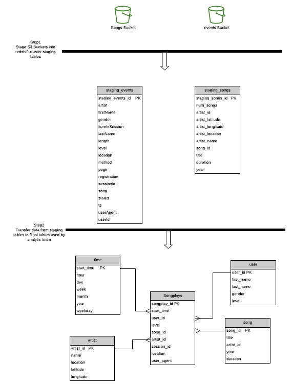

# Introduction
A music streaming startup, Sparkify, has grown their user base and song database and want to move their processes and data onto the cloud. Their data resides in S3, in a directory of JSON logs on user activity on the app, as well as a directory with JSON metadata on the songs in their app.

As their data engineer, I built an ETL pipeline that extracts their data from S3, stages them in Redshift, and transforms data into a set of dimensional tables for their analytics team to continue finding insights in what songs their users are listening to.
# Project Description
In this project,I apply what I've learned on data warehouses and AWS to build an ETL pipeline for a database hosted on Redshift. I load data from S3 to staging tables on Redshift and execute SQL statements that create the analytics tables from these staging tables.

# Project Datasets
Here are the S3 links for sparkify database:

* Song data: s3://udacity-dend/song_data
* Log data: s3://udacity-dend/log_data
* Log data json path: s3://udacity-dend/log_json_path.json

# Project Steps

* Create Table Schemas and ETL pipline
    - **Staging tables**
        - staging_events(staging_events_id,artist,auth,firstName,gender,itemInSession,lastName,length,level,location,method,page,registration   ,sessionId,song,status,ts,userAgent,userId) with distriution key on ("song") and sorting key on ("ts");

        - staging_songs(staging_songs_id ,num_songs,artist_id,artist_latitude,artist_longitude,artist_location,artist_name,song_id,title            ,duration, year) with distriution key on ("title")
    - **Fact Table**
        - songplays - records in event data associated with song plays (songplay_id, start_time, user_id, level, song_id, artist_id, session_id, location, user_agent)
    - **Dimension Tables**
        - users - users in the app ( user_id, first_name, last_name, gender, level)
        - songs - songs in music database(song_id, title, artist_id, year, duration)
        - artists - artists in music database(artist_id, name, location, lattitude, longitude)
        - time - timestamps of records in songplays broken down into specific units( start_time, hour, day, week, month, year, weekday)

As shown in the image I created staging tables and final tables for analytic

# How To Run

To succefully run this project follow the steps in the comand line:
*  *python create_tables.py* in order to create staging and final tables in redshift cluster
*  *python etl.py* in order to transfor data from s3 to staging tables the from staging tables to final tables
*  *python analytic_queries.py* to test queries on the final tables
